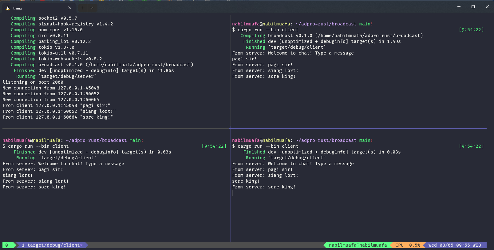
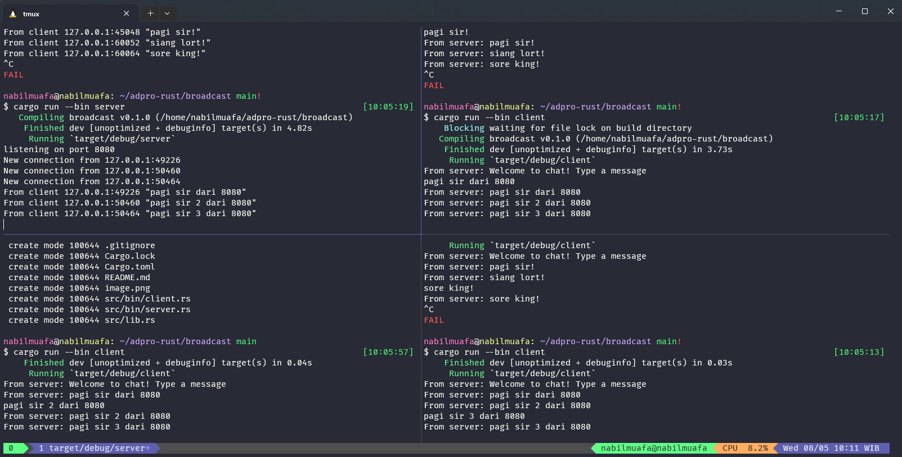

# Tutorial 10.2 Reflection Notes

## 2.1 Original code of broadcast chat

Pada gambar ini, kiri atas adalah server sementara yang lainnya adalah client. Untuk menjalankan server ataupun client, perlu dijalankan perintah `cargo run --bin (server/client)`. Jadi dalam kasus ini, saya menjalankan `cargo run --bin server` di kiri atas dan `cargo run --bin client` di instance terminal lainnya. Ketika client dijalankan, maka server akan menangkap bahwa terdapat koneksi baru dari client tersebut, begitu juga dari client-client lainnya. Ketika saya mengetik di salah satu client, maka pesan dari client tersebut akan terkirim ke server, dan kemudian pesan tersebut akan di-broadcast ke server oleh setiap client yang terkoneksi ke server. Itulah mengapa setelah mengetik meskipun hanya di salah satu client, semua client menerima pesan yang diketik.

# 2.2 Modifying the websocket port

Setelah port diubah, broadcast chat masih berjalan seperti biasa. Bedanya, disini kita meminta secara eksplisit untuk server agar listen pada port 8080. Untuk memastikan bahwa broadcast masih bisa berjalan, maka kedua websocket, baik dari sisi client maupun server, harus berjalan pada port yang sama. Jika portnya berbeda, maka kedua sisi tidak akan bisa berkomunikasi dan tidak bisa saling berkoneksi. Dalam hal ini, karena kita punya `client.rs` dan `server.rs`, kita perlu mengganti port pada kedua websocket yang didefinisikan pada file tersebut. Kedua websocket terlihat menggunakan protokol yang sama, yaitu TCP.
